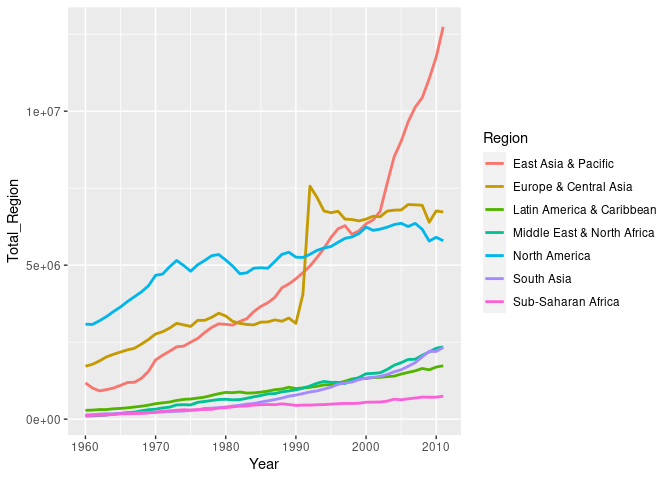
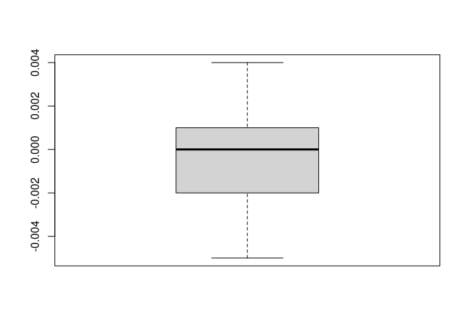
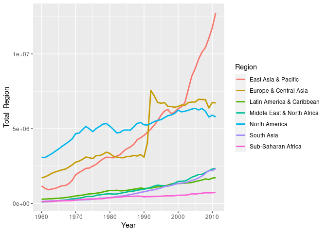
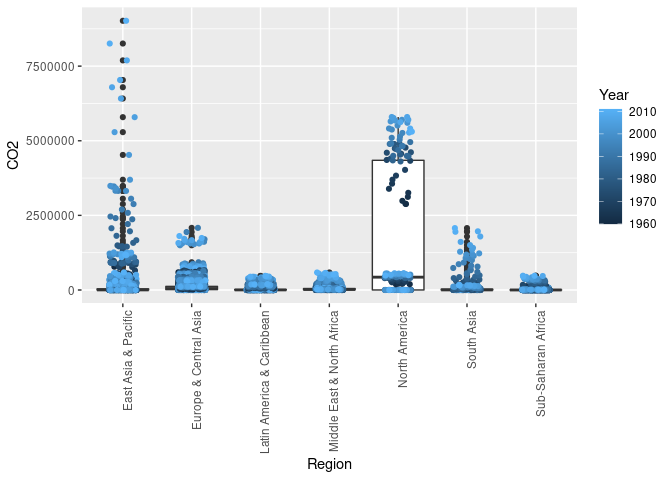
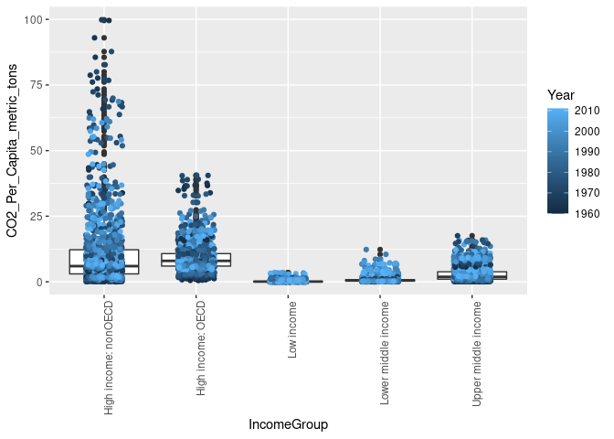
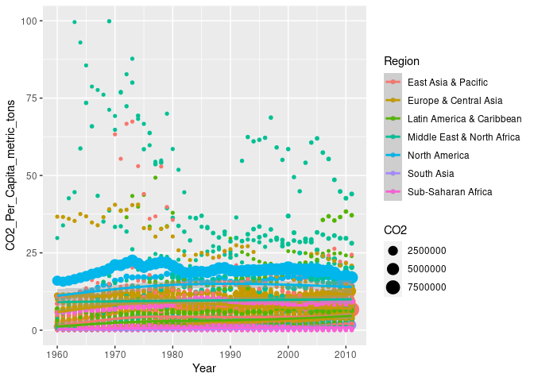

# title: "Emisiones de CO2 en el mundo."

## Datos CO2


El siguiente enlace [WorldBankCO2](https://mkt.tableau.com/Public/Datasets/World_Bank_CO2.xlsx)
nos da acceso a un conocido data set  de [THE WORLD BANK](https://datacatalog.worldbank.org/). En concreto  la versión de este data set es la de de [Tableau Open Data Sets](https://www.tableau.com/learn/articles/free-public-data-sets) una colección de datos del programa [Tableau](https://public.tableau.com/en-us/s/gallery) que es un programa para  representar gráficas, paneles de control o [_dahsboards_](https://en.wikipedia.org/wiki/Dashboard_(business)) y los llamados [KPIs](https://en.wikipedia.org/wiki/Dashboard_(business)). 

En esta actividad se trata en primer lugar que entendáis  los datos del fichero y que lo leáis de forma directa desde el archivo .xlsx y transforméis en tibbles o data frames de R.

El fichero excel consta de 9 hojas  y podemos explorarlo y leerlo con varios paquetes de R. Uno de estos es `readr`

Por ejemplo el siguiente código nos da los nombres de las sheets del fichero


```r
library(readxl)
filename="World_Bank_CO2.xlsx"
sheets_names <- readxl::excel_sheets(filename)
sheets_names
```

```
## [1] "About"                    "CO2 (kt) Pivoted"        
## [3] "CO2 (kt) RAW DATA"        "CO2 Data Cleaned"        
## [5] "CO2 (kt) for Split"       "CO2 for World to Union"  
## [7] "CO2 Per Capita RAW DATA"  "CO2 Per Capita (Pivoted)"
## [9] "Metadata - Countries"
```

Ahora podemos leer cada hoja


```r
read_excel_allsheets <- function(filename) {
    sheets_names <- readxl::excel_sheets(filename)
    x <- lapply(sheets_names, function(X) readxl::read_excel(filename, sheet = X))
    names(x) <- sheets_names
    return(x)
    }
```


El siguiente código lee todas las sheets del excel y pone cada una en una lista de objetos llamada all_data_CO2. Cada objeto se llama con el nombre de la hoja


```r
all_data_CO2=read_excel_allsheets(filename)
class(all_data_CO2)
```

```
## [1] "list"
```

```r
lapply(all_data_CO2,FUN=function(x) c(class=paste(class(x),collapse=", "),col_names=paste(names(x),collapse=", ")))
```

```
## $About
##                                                                                                                                              class 
##                                                                                                                          "tbl_df, tbl, data.frame" 
##                                                                                                                                          col_names 
## "Data from http://data.worldbank.org/indicator/EN.ATM.CO2E.PC and http://data.worldbank.org/indicator/EN.ATM.CO2E.KT both last updated 02/05/2016" 
## 
## $`CO2 (kt) Pivoted`
##                                                class 
##                            "tbl_df, tbl, data.frame" 
##                                            col_names 
## "Country Name, Country Code, Region, Year, CO2 (kt)" 
## 
## $`CO2 (kt) RAW DATA`
##                                                                                                                                                                                                                                                                                                                                                                                                        class 
##                                                                                                                                                                                                                                                                                                                                                                                    "tbl_df, tbl, data.frame" 
##                                                                                                                                                                                                                                                                                                                                                                                                    col_names 
## "Country Name, Country Code, Indicator Name, Indicator Code, 1960, 1961, 1962, 1963, 1964, 1965, 1966, 1967, 1968, 1969, 1970, 1971, 1972, 1973, 1974, 1975, 1976, 1977, 1978, 1979, 1980, 1981, 1982, 1983, 1984, 1985, 1986, 1987, 1988, 1989, 1990, 1991, 1992, 1993, 1994, 1995, 1996, 1997, 1998, 1999, 2000, 2001, 2002, 2003, 2004, 2005, 2006, 2007, 2008, 2009, 2010, 2011, 2012, 2013, 2014, 2015" 
## 
## $`CO2 Data Cleaned`
##                                                                              class 
##                                                          "tbl_df, tbl, data.frame" 
##                                                                          col_names 
## "Country Code, Country Name, Region, Year, CO2 (kt), CO2 Per Capita (metric tons)" 
## 
## $`CO2 (kt) for Split`
##                                                class 
##                            "tbl_df, tbl, data.frame" 
##                                            col_names 
## "Country Code, Country Name, Region, Year, CO2 (kt)" 
## 
## $`CO2 for World to Union`
##                     class                 col_names 
## "tbl_df, tbl, data.frame"                        "" 
## 
## $`CO2 Per Capita RAW DATA`
##                                                                                                                                                                                                                                                                                                                                                                                                        class 
##                                                                                                                                                                                                                                                                                                                                                                                    "tbl_df, tbl, data.frame" 
##                                                                                                                                                                                                                                                                                                                                                                                                    col_names 
## "Country Name, Country Code, Indicator Name, Indicator Code, 1960, 1961, 1962, 1963, 1964, 1965, 1966, 1967, 1968, 1969, 1970, 1971, 1972, 1973, 1974, 1975, 1976, 1977, 1978, 1979, 1980, 1981, 1982, 1983, 1984, 1985, 1986, 1987, 1988, 1989, 1990, 1991, 1992, 1993, 1994, 1995, 1996, 1997, 1998, 1999, 2000, 2001, 2002, 2003, 2004, 2005, 2006, 2007, 2008, 2009, 2010, 2011, 2012, 2013, 2014, 2015" 
## 
## $`CO2 Per Capita (Pivoted)`
##                                                            class 
##                                        "tbl_df, tbl, data.frame" 
##                                                        col_names 
## "Country Name, Country Code, Year, CO2 Per Capita (metric tons)" 
## 
## $`Metadata - Countries`
##                                                        class 
##                                    "tbl_df, tbl, data.frame" 
##                                                    col_names 
## "Country Code, Region, IncomeGroup, SpecialNotes, TableName"
```


## Contexto mundial en emisiones de contaminantes

Os pongo algunos enlaces. A partir de estos buscad más.


* [Protocolo de kioto (wikipedia)](https://es.wikipedia.org/wiki/Protocolo_de_Kioto)
* [Cambio Climático .org](http://www.cambioclimatico.org/tema/protocolo-de-kyoto)
* [Acuerdo de París](https://es.wikipedia.org/wiki/Acuerdo_de_Par%C3%ADs)
* [Acuerdo de París Comisón Europea](https://ec.europa.eu/clima/policies/international/negotiations/paris_es)


## Un gráfico


```r
all_data_CO2$`CO2 (kt) Pivoted`%>% group_by(`Year`,`Region`) %>% summarise(Total_Region=sum(`CO2 (kt)`,na.rm=TRUE)) %>% ggplot(aes(x = Year, y = `Total_Region`)) +   geom_line(aes(color = `Region`), size = 1)
```

```
## `summarise()` regrouping output by 'Year' (override with `.groups` argument)
```

<!-- -->


## Conversiones desde los raw data y ajuste de metadatos
 
 Primero por unas cuestiones de comodidad modificarermos los nombres de las tibbles y de las variables de cada tibble para no necesitar ponerlos
 entre ``.


```r
data_CO2=all_data_CO2
names(data_CO2)
```

```
## [1] "About"                    "CO2 (kt) Pivoted"        
## [3] "CO2 (kt) RAW DATA"        "CO2 Data Cleaned"        
## [5] "CO2 (kt) for Split"       "CO2 for World to Union"  
## [7] "CO2 Per Capita RAW DATA"  "CO2 Per Capita (Pivoted)"
## [9] "Metadata - Countries"
```

```r
long_names=names(data_CO2)# los guardo para el jefe
long_names
```

```
## [1] "About"                    "CO2 (kt) Pivoted"        
## [3] "CO2 (kt) RAW DATA"        "CO2 Data Cleaned"        
## [5] "CO2 (kt) for Split"       "CO2 for World to Union"  
## [7] "CO2 Per Capita RAW DATA"  "CO2 Per Capita (Pivoted)"
## [9] "Metadata - Countries"
```

```r
arreglo_names=function(x) return(gsub("_$","",gsub("(__+)","_",gsub("\\(|\\)|\\-|\\s","_",names(x)))))
names(data_CO2)=arreglo_names(data_CO2)
names(data_CO2)
```

```
## [1] "About"                   "CO2_kt_Pivoted"         
## [3] "CO2_kt_RAW_DATA"         "CO2_Data_Cleaned"       
## [5] "CO2_kt_for_Split"        "CO2_for_World_to_Union" 
## [7] "CO2_Per_Capita_RAW_DATA" "CO2_Per_Capita_Pivoted" 
## [9] "Metadata_Countries"
```

```r
for(sheet in 1:length(data_CO2)) {
names(data_CO2[[sheet]])=arreglo_names(data_CO2[[sheet]])
}


print(data_CO2$CO2_kt_RAW_DATA,n=20,width = Inf)
```

```
## # A tibble: 248 x 60
##    Country_Name         Country_Code Indicator_Name     Indicator_Code
##    <chr>                <chr>        <chr>              <chr>         
##  1 Aruba                ABW          CO2 emissions (kt) EN.ATM.CO2E.KT
##  2 Andorra              AND          CO2 emissions (kt) EN.ATM.CO2E.KT
##  3 Afghanistan          AFG          CO2 emissions (kt) EN.ATM.CO2E.KT
##  4 Angola               AGO          CO2 emissions (kt) EN.ATM.CO2E.KT
##  5 Romania              ALB          CO2 emissions (kt) EN.ATM.CO2E.KT
##  6 Arab World           ARB          CO2 emissions (kt) EN.ATM.CO2E.KT
##  7 United Arab Emirates ARE          CO2 emissions (kt) EN.ATM.CO2E.KT
##  8 Argentina            ARG          CO2 emissions (kt) EN.ATM.CO2E.KT
##  9 Armenia              ARM          CO2 emissions (kt) EN.ATM.CO2E.KT
## 10 American Samoa       ASM          CO2 emissions (kt) EN.ATM.CO2E.KT
## 11 Antigua and Barbuda  ATG          CO2 emissions (kt) EN.ATM.CO2E.KT
## 12 Australia            AUS          CO2 emissions (kt) EN.ATM.CO2E.KT
## 13 Austria              AUT          CO2 emissions (kt) EN.ATM.CO2E.KT
## 14 Azerbaijan           AZE          CO2 emissions (kt) EN.ATM.CO2E.KT
## 15 Burundi              BDI          CO2 emissions (kt) EN.ATM.CO2E.KT
## 16 Belgium              BEL          CO2 emissions (kt) EN.ATM.CO2E.KT
## 17 Benin                BEN          CO2 emissions (kt) EN.ATM.CO2E.KT
## 18 Burkina Faso         BFA          CO2 emissions (kt) EN.ATM.CO2E.KT
## 19 Bangladesh           BGD          CO2 emissions (kt) EN.ATM.CO2E.KT
## 20 Bulgaria             BGR          CO2 emissions (kt) EN.ATM.CO2E.KT
##    `1960`           `1961`           `1962`           `1963`          
##    <chr>            <chr>            <chr>            <chr>           
##  1 null             null             null             null            
##  2 null             null             null             null            
##  3 414.371          491.378          689.396          707.731         
##  4 550.05           454.708          1180.774         1151.438        
##  5 2024.184         2280.874         2464.224         2082.856        
##  6 59563.9892169935 65151.0958106249 74357.7077270689 87895.9791576292
##  7 11.001           11.001           18.335           22.002          
##  8 48815.104        51180.319        53695.881        50083.886       
##  9 null             null             null             null            
## 10 null             null             null             null            
## 11 36.67            47.671           102.676          84.341          
## 12 88202.351        90589.568        94912.961        101029.517      
## 13 30821.135        31862.563        33905.082        36992.696       
## 14 null             null             null             null            
## 15 null             null             44.004           47.671          
## 16 91000.272        92793.435        98117.919        105781.949      
## 17 161.348          128.345          135.679          121.011         
## 18 44.004           91.675           84.341           88.008          
## 19 null             null             null             null            
## 20 22295.36         25973.361        30736.794        34411.128       
##    `1964`           `1965`           `1966`           `1967`          
##    <chr>            <chr>            <chr>            <chr>           
##  1 null             null             null             null            
##  2 null             null             null             null            
##  3 839.743          1008.425         1092.766         1283.45         
##  4 1224.778         1188.108         1554.808         993.757         
##  5 2016.85          2174.531         2552.232         2680.577        
##  6 103196.281576983 123828.196879996 139079.150106116 149730.959074154
##  7 18.335           22.002           25.669           916.75          
##  8 55727.399        58866.351        63138.406        65543.958       
##  9 null             null             null             null            
## 10 null             null             null             null            
## 11 91.675           150.347          348.365          564.718         
## 12 108979.573       120966.996       120332.605       129265.417      
## 13 38943.54         38188.138        39258.902        39966.633       
## 14 null             null             null             null            
## 15 47.671           36.67            47.671           47.671          
## 16 103662.423       105440.918       105206.23        107472.436      
## 17 143.013          150.347          113.677          143.013         
## 18 110.01           102.676          102.676          102.676         
## 19 null             null             null             null            
## 20 42863.563        46317.877        48767.433        55166.348       
##    `1968`          `1969`           `1970`           `1971`          
##    <chr>           <chr>            <chr>            <chr>           
##  1 null            null             null             null            
##  2 null            null             null             null            
##  3 1224.778        942.419          1672.152         1895.839        
##  4 1672.152        2786.92          3582.659         3410.31         
##  5 3072.946        3245.295         3744.007         4352.729        
##  6 178805.03861786 213131.612521753 220575.399078328 250915.803258137
##  7 1243.113        20524.199        15247.386        21184.259       
##  8 69082.613       77329.696        82734.854        88939.418       
##  9 null            null             null             null            
## 10 null            null             null             null            
## 11 990.09          1257.781         462.042          425.372         
## 12 134622.904      142257.598       147618.752       152774.554      
## 13 42350.183       44693.396        50692.608        52155.741       
## 14 null            null             null             null            
## 15 55.005          73.34            62.339           73.34           
## 16 118557.777      123618.237       125620.419       121528.047      
## 17 154.014         201.685          282.359          293.36          
## 18 102.676         121.011          143.013          150.347         
## 19 null            null             null             null            
## 20 59526.411       66376.367        61238.9          64300.845       
##    `1972`          `1973`           `1974`         `1975`         
##    <chr>           <chr>            <chr>          <chr>          
##  1 null            null             null           null           
##  2 null            null             null           null           
##  3 1532.806        1639.149         1917.841       2126.86        
##  4 4506.743        4880.777         4873.443       4415.068       
##  5 5643.513        5291.481         4345.395       4594.751       
##  6 272872.77129632 318599.937431339 310921.2384785 307786.62619087
##  7 23454.132       30630.451        31327.181      31070.491      
##  8 90156.862       94065.884        95569.354      94931.296      
##  9 null            null             null           null           
## 10 null            null             null           null           
## 11 374.034         330.03           429.039        707.731        
## 12 157486.649      170992.21        172356.334     175883.988     
## 13 56193.108       60164.469        57469.224      54392.611      
## 14 null            null             null           null           
## 15 73.34           73.34            91.675         77.007         
## 16 130834.893      138872.957       135220.625     122100.099     
## 17 388.702         381.368          407.037        443.707        
## 18 161.348         168.682          205.352        220.02         
## 19 3509.319        4554.414         4660.757       4869.776       
## 20 66171.015       68825.923        71260.811      73061.308      
##    `1976`           `1977`           `1978`           `1979`         
##    <chr>            <chr>            <chr>            <chr>          
##  1 null             null             null             null           
##  2 null             null             null             null           
##  3 1987.514         2390.884         2159.863         2240.537       
##  4 3285.632         3534.988         5412.492         5504.167       
##  5 4950.45          5720.52          6494.257         7587.023       
##  6 373496.028032987 395284.152786356 425910.856449111 456159.49797413
##  7 39651.271        38785.859        44814.407        36607.661      
##  8 99786.404        100791.162       102639.33        110703.063     
##  9 null             null             null             null           
## 10 null             null             null             null           
## 11 403.37           465.709          491.378          407.037        
## 12 174244.839       187787.07        202015.03        205069.641     
## 13 58415.31         56218.777        57483.892        61594.599      
## 14 null             null             null             null           
## 15 88.008           99.009           102.676          110.01         
## 16 130009.818       126570.172       135855.016       140233.414     
## 17 260.357          297.027          363.033          366.7          
## 18 209.019          249.356          348.365          407.037        
## 19 5570.173         5812.195         6017.547         6648.271       
## 20 73116.313        75969.239        81411.067        79152.195      
##    `1980`           `1981`           `1982`           `1983`          
##    <chr>            <chr>            <chr>            <chr>           
##  1 null             null             null             null            
##  2 null             null             null             null            
##  3 1760.16          1983.847         2101.191         2522.896        
##  4 5346.486         5280.48          4649.756         5115.465        
##  5 5170.47          7341.334         7308.331         7631.027        
##  6 508779.874736983 497496.738703989 476949.245043382 508651.407020277
##  7 36904.688        36857.017        36871.685        35342.546       
##  8 108737.551       102041.609       103424.068       105213.564      
##  9 null             null             null             null            
## 10 null             null             null             null            
## 11 143.013          106.343          293.36           84.341          
## 12 220746.066       230360.94        234119.615       225003.453      
## 13 52306.088        56130.769        53868.23         51983.392       
## 14 null             null             null             null            
## 15 146.68           157.681          157.681          205.352         
## 16 135301.299       124021.607       117553.019       101630.905      
## 17 517.047          429.039          502.379          462.042         
## 18 432.706          557.384          575.719          594.054         
## 19 7638.361         7931.721         8599.115         8236.082        
## 20 77487.377        80343.97         90131.193        90365.881       
##    `1984`           `1985`           `1986`           `1987`          
##    <chr>            <chr>            <chr>            <chr>           
##  1 null             null             179.683          447.374         
##  2 null             null             null             null            
##  3 2830.924         3509.319         3142.619         3124.284        
##  4 5009.122         4701.094         4660.757         5815.862        
##  5 7825.378         7880.383         8056.399         7444.01         
##  6 554903.455540696 587093.794841074 648475.669883289 649749.335531776
##  7 46394.884        49926.205        47234.627        47693.002       
##  8 106522.683       100596.811       104212.473       114942.115      
##  9 null             null             null             null            
## 10 null             null             null             null            
## 11 146.68           249.356          249.356          275.025         
## 12 236594.84        241229.928       239964.813       256106.947      
## 13 54550.292        54700.639        54080.916        57744.249       
## 14 null             null             null             null            
## 15 220.02           231.021          242.022          267.691         
## 16 105422.583       104472.83        102874.018       103116.04       
## 17 513.38           744.401          693.063          539.049         
## 18 465.709          476.71           480.377          517.047         
## 19 9123.496         10234.597        11463.042        11862.745       
## 20 87366.275        89540.806        91528.32         91634.663       
##    `1988`           `1989`           `1990`           `1991`          
##    <chr>            <chr>            <chr>            <chr>           
##  1 612.389          649.059          1840.834         1928.842        
##  2 null             null             null             null            
##  3 2867.594         2775.919         2676.91          2493.56         
##  4 5130.133         5009.122         4429.736         4367.397        
##  5 7326.666         8984.15          7488.014         3971.361        
##  6 688649.360150409 699737.959355248 711039.447919201 749355.862053369
##  7 48367.73         54487.953        52009.061        57010.849       
##  8 121473.042       117090.977       112613.57        117021.304      
##  9 null             null             null             null            
## 10 null             null             null             null            
## 11 286.026          286.026          300.694          289.693         
## 12 261145.405       277771.583       263847.984       261574.444      
## 13 53340.182        54117.586        57722.247        61638.603       
## 14 null             null             null             null            
## 15 256.69           300.694          293.36           337.364         
## 16 100354.789       107461.435       106049.64        110959.753      
## 17 561.051          641.725          715.065          828.742         
## 18 553.717          821.408          586.72           627.057         
## 19 13545.898        13454.223        15533.412        15940.449       
## 20 87289.268        86739.218        75763.887        58176.955       
##    `1992`           `1993`           `1994`           `1995`          
##    <chr>            <chr>            <chr>            <chr>           
##  1 1723.49          1771.161         1763.827         1782.162        
##  2 null             null             null             407.037         
##  3 1426.463         1375.125         1320.12          1268.782        
##  4 4418.735         5801.194         3890.687         11012.001       
##  5 2387.217         2343.213         1928.842         2086.523        
##  6 809684.301818593 886394.210716952 914334.103847451 876887.599680694
##  7 58136.618        65980.331        73130.981        70641.088       
##  8 121447.373       118609.115       123350.546       122547.473      
##  9 4052.035         2896.93          2966.603         3490.984        
## 10 null             null             null             null            
## 11 289.693          304.361          311.695          322.696         
## 12 268068.701       277478.223       278204.289       281940.962      
## 13 56688.153        57135.527        57095.19         59827.105       
## 14 57678.243        49365.154        42672.879        33479.71        
## 15 308.028          326.363          333.697          322.696         
## 16 111968.178       107652.119       112334.878       112327.544      
## 17 905.749          1133.103         1265.115         1327.454        
## 18 630.724          627.057          645.392          627.057         
## 19 17748.28         17407.249        18969.391        22816.074       
## 20 54458.617        68077.855        54344.94         58004.606       
##    `1996`           `1997`           `1998`          `1999`          
##    <chr>            <chr>            <chr>           <chr>           
##  1 1800.497         1837.167         1712.489        1749.159        
##  2 425.372          458.375          484.044         513.38          
##  3 1199.109         1114.768         1056.096        832.409         
##  4 10491.287        7381.671         7308.331        9156.499        
##  5 2016.85          1543.807         1752.826        2984.938        
##  6 869025.276687132 836526.206759494 906453.79546541 920061.425397742
##  7 41059.399        41646.119        81495.408       78374.791       
##  8 129217.746       134677.909       137673.848      145488.225      
##  9 2607.237         3278.298         3406.643        3058.278        
## 10 null             null             null            null            
## 11 322.696          337.364          333.697         348.365         
## 12 302241.474       305838.801       316964.479      325380.244      
## 13 63226.414        62705.7          63717.792       61917.295       
## 14 31510.531        29809.043        31675.546       28576.931       
## 15 319.029          304.361          293.36          286.026         
## 16 118059.065       115341.818       118374.427      115085.128      
## 17 1265.115         1217.444         1213.777        1562.142        
## 18 707.731          806.74           861.745         931.418         
## 19 24029.851        25063.945        24048.186       25236.294       
## 20 56559.808        51616.692        48998.454       43981.998       
##    `2000`      `2001`     `2002`      `2003`      `2004`      `2005`     
##    <chr>       <chr>      <chr>       <chr>       <chr>       <chr>      
##  1 2321.211    2357.881   2372.549    2416.553    2420.22     2497.227   
##  2 524.381     524.381    531.715     535.382     564.718     575.719    
##  3 781.071     645.392    894.748     1037.761    957.087     1338.455   
##  4 9541.534    9732.218   12665.818   9064.824    18793.375   19156.408  
##  5 3021.608    3223.293   3751.341    4294.057    4165.712    4253.72    
##  6 1045912.741 1029730.27 1050712.844 1138783.183 1254917.073 1318865.886
##  7 112562.232  101414.552 84704.033   106841.712  113240.627  116148.558 
##  8 141076.824  132631.723 123266.205  133126.768  156170.196  160951.964 
##  9 3465.315    3542.322   3043.61     3428.645    3644.998    4352.729   
## 10 null        null       null        null        null        null       
## 11 344.698     344.698    363.033     388.702     407.037     410.704    
## 12 329479.95   324877.865 341390.366  336355.575  342776.492  350268.173 
## 13 62188.653   65785.98   66977.755   72074.885   72272.903   74278.752  
## 14 29508.349   28771.282  29614.692   30615.783   32089.917   34337.788  
## 15 289.693     205.352    212.686     161.348     198.018     154.014    
## 16 114894.444  114315.058 107098.402  114564.414  110908.415  108297.511 
## 17 1598.812    1815.165   2079.189    2354.214    2508.228    2394.551   
## 18 1041.428    997.424    1004.758    1078.098    1103.767    1125.769   
## 19 27869.2     32456.617  33707.064   33883.08    39750.28    37553.747  
## 20 43530.957   46453.556  44634.724   47307.967   46787.253   47909.355  
##    `2006`      `2007`      `2008`      `2009`      `2010`      `2011`     
##    <chr>       <chr>       <chr>       <chr>       <chr>       <chr>      
##  1 2497.227    2592.569    2508.228    2522.896    2456.89     2438.555   
##  2 546.383     539.049     539.049     517.047     517.047     491.378    
##  3 1657.484    2280.874    4217.05     6776.616    8470.77     12251.447  
##  4 22266.024   25151.953   27172.47    29361.669   29743.037   29710.034  
##  5 3865.018    4477.407    4657.09     4488.408    4415.068    4668.091   
##  6 1375301.016 1374211.917 1472417.844 1577099.693 1680300.074 1704417.933
##  7 123874.927  139404.672  158935.114  162602.114  167596.568  178483.891 
##  8 174237.505  179738.005  191578.748  180654.755  179000.938  190034.941 
##  9 4382.065    5064.127    5559.172    4360.063    4217.05     4961.451   
## 10 null        null        null        null        null        null       
## 11 425.372     469.376     480.377     509.713     524.381     513.38     
## 12 357946.871  363795.736  376197.53   382464.433  368170.467  369039.546 
## 13 72214.231   69724.338   68752.583   63483.104   67975.179   65202.927  
## 14 39167.227   30509.44    35503.894   31902.9     30678.122   33457.708  
## 15 187.017     187.017     190.684     190.684     194.351     209.019    
## 16 106775.706  103215.049  103882.443  104021.789  109093.25   97765.887  
## 17 3872.352    4495.742    4488.408    4752.432    5152.135    4987.12    
## 18 1360.457    1646.483    1697.821    1664.818    1683.153    1932.509   
## 19 48136.709   46886.262   49581.507   52790.132   56152.771   57069.521  
## 20 48943.449   52188.744   50791.617   42654.544   44128.678   49339.485  
##    `2012` `2013` `2014` `2015`
##    <lgl>  <lgl>  <lgl>  <lgl> 
##  1 NA     NA     NA     NA    
##  2 NA     NA     NA     NA    
##  3 NA     NA     NA     NA    
##  4 NA     NA     NA     NA    
##  5 NA     NA     NA     NA    
##  6 NA     NA     NA     NA    
##  7 NA     NA     NA     NA    
##  8 NA     NA     NA     NA    
##  9 NA     NA     NA     NA    
## 10 NA     NA     NA     NA    
## 11 NA     NA     NA     NA    
## 12 NA     NA     NA     NA    
## 13 NA     NA     NA     NA    
## 14 NA     NA     NA     NA    
## 15 NA     NA     NA     NA    
## 16 NA     NA     NA     NA    
## 17 NA     NA     NA     NA    
## 18 NA     NA     NA     NA    
## 19 NA     NA     NA     NA    
## 20 NA     NA     NA     NA    
## # … with 228 more rows
```


```r
glimpse(data_CO2$CO2_kt_RAW_DATA) # es similar en algunos caso a str pero es mas adecuado para tibbles complejas
```

```
## Rows: 248
## Columns: 60
## $ Country_Name   <chr> "Aruba", "Andorra", "Afghanistan", "Angola", "Romania"…
## $ Country_Code   <chr> "ABW", "AND", "AFG", "AGO", "ALB", "ARB", "ARE", "ARG"…
## $ Indicator_Name <chr> "CO2 emissions (kt)", "CO2 emissions (kt)", "CO2 emiss…
## $ Indicator_Code <chr> "EN.ATM.CO2E.KT", "EN.ATM.CO2E.KT", "EN.ATM.CO2E.KT", …
## $ `1960`         <chr> "null", "null", "414.371", "550.05", "2024.184", "5956…
## $ `1961`         <chr> "null", "null", "491.378", "454.708", "2280.874", "651…
## $ `1962`         <chr> "null", "null", "689.396", "1180.774", "2464.224", "74…
## $ `1963`         <chr> "null", "null", "707.731", "1151.438", "2082.856", "87…
## $ `1964`         <chr> "null", "null", "839.743", "1224.778", "2016.85", "103…
## $ `1965`         <chr> "null", "null", "1008.425", "1188.108", "2174.531", "1…
## $ `1966`         <chr> "null", "null", "1092.766", "1554.808", "2552.232", "1…
## $ `1967`         <chr> "null", "null", "1283.45", "993.757", "2680.577", "149…
## $ `1968`         <chr> "null", "null", "1224.778", "1672.152", "3072.946", "1…
## $ `1969`         <chr> "null", "null", "942.419", "2786.92", "3245.295", "213…
## $ `1970`         <chr> "null", "null", "1672.152", "3582.659", "3744.007", "2…
## $ `1971`         <chr> "null", "null", "1895.839", "3410.31", "4352.729", "25…
## $ `1972`         <chr> "null", "null", "1532.806", "4506.743", "5643.513", "2…
## $ `1973`         <chr> "null", "null", "1639.149", "4880.777", "5291.481", "3…
## $ `1974`         <chr> "null", "null", "1917.841", "4873.443", "4345.395", "3…
## $ `1975`         <chr> "null", "null", "2126.86", "4415.068", "4594.751", "30…
## $ `1976`         <chr> "null", "null", "1987.514", "3285.632", "4950.45", "37…
## $ `1977`         <chr> "null", "null", "2390.884", "3534.988", "5720.52", "39…
## $ `1978`         <chr> "null", "null", "2159.863", "5412.492", "6494.257", "4…
## $ `1979`         <chr> "null", "null", "2240.537", "5504.167", "7587.023", "4…
## $ `1980`         <chr> "null", "null", "1760.16", "5346.486", "5170.47", "508…
## $ `1981`         <chr> "null", "null", "1983.847", "5280.48", "7341.334", "49…
## $ `1982`         <chr> "null", "null", "2101.191", "4649.756", "7308.331", "4…
## $ `1983`         <chr> "null", "null", "2522.896", "5115.465", "7631.027", "5…
## $ `1984`         <chr> "null", "null", "2830.924", "5009.122", "7825.378", "5…
## $ `1985`         <chr> "null", "null", "3509.319", "4701.094", "7880.383", "5…
## $ `1986`         <chr> "179.683", "null", "3142.619", "4660.757", "8056.399",…
## $ `1987`         <chr> "447.374", "null", "3124.284", "5815.862", "7444.01", …
## $ `1988`         <chr> "612.389", "null", "2867.594", "5130.133", "7326.666",…
## $ `1989`         <chr> "649.059", "null", "2775.919", "5009.122", "8984.15", …
## $ `1990`         <chr> "1840.834", "null", "2676.91", "4429.736", "7488.014",…
## $ `1991`         <chr> "1928.842", "null", "2493.56", "4367.397", "3971.361",…
## $ `1992`         <chr> "1723.49", "null", "1426.463", "4418.735", "2387.217",…
## $ `1993`         <chr> "1771.161", "null", "1375.125", "5801.194", "2343.213"…
## $ `1994`         <chr> "1763.827", "null", "1320.12", "3890.687", "1928.842",…
## $ `1995`         <chr> "1782.162", "407.037", "1268.782", "11012.001", "2086.…
## $ `1996`         <chr> "1800.497", "425.372", "1199.109", "10491.287", "2016.…
## $ `1997`         <chr> "1837.167", "458.375", "1114.768", "7381.671", "1543.8…
## $ `1998`         <chr> "1712.489", "484.044", "1056.096", "7308.331", "1752.8…
## $ `1999`         <chr> "1749.159", "513.38", "832.409", "9156.499", "2984.938…
## $ `2000`         <chr> "2321.211", "524.381", "781.071", "9541.534", "3021.60…
## $ `2001`         <chr> "2357.881", "524.381", "645.392", "9732.218", "3223.29…
## $ `2002`         <chr> "2372.549", "531.715", "894.748", "12665.818", "3751.3…
## $ `2003`         <chr> "2416.553", "535.382", "1037.761", "9064.824", "4294.0…
## $ `2004`         <chr> "2420.22", "564.718", "957.087", "18793.375", "4165.71…
## $ `2005`         <chr> "2497.227", "575.719", "1338.455", "19156.408", "4253.…
## $ `2006`         <chr> "2497.227", "546.383", "1657.484", "22266.024", "3865.…
## $ `2007`         <chr> "2592.569", "539.049", "2280.874", "25151.953", "4477.…
## $ `2008`         <chr> "2508.228", "539.049", "4217.05", "27172.47", "4657.09…
## $ `2009`         <chr> "2522.896", "517.047", "6776.616", "29361.669", "4488.…
## $ `2010`         <chr> "2456.89", "517.047", "8470.77", "29743.037", "4415.06…
## $ `2011`         <chr> "2438.555", "491.378", "12251.447", "29710.034", "4668…
## $ `2012`         <lgl> NA, NA, NA, NA, NA, NA, NA, NA, NA, NA, NA, NA, NA, NA…
## $ `2013`         <lgl> NA, NA, NA, NA, NA, NA, NA, NA, NA, NA, NA, NA, NA, NA…
## $ `2014`         <lgl> NA, NA, NA, NA, NA, NA, NA, NA, NA, NA, NA, NA, NA, NA…
## $ `2015`         <lgl> NA, NA, NA, NA, NA, NA, NA, NA, NA, NA, NA, NA, NA, NA…
```

```r
#str(all_data_CO2$`CO2_(kt)_RAW_DATA`)

library(naniar)# cargar para la función replace_with_na. El paquete naniar aporta utilizades para tartar NA
# ver un manual en https://cran.r-project.org/web/packages/naniar/vignettes/getting-started-w-naniar.html
data_CO2$CO2_kt_RAW_DATA %>% gather(`1960`:`2015`, key="Year", value="CO2") %>%
  naniar::replace_with_na(replace =list(CO2 ="null")) %>%
  mutate(Year=as.integer(Year),CO2=as.numeric(CO2)) %>%
  arrange(Country_Code) -> aux
# nota cambiar gather (función retirada) por pivot_longer EJERCICIO

print(aux,n=10,width=Inf)
```

```
## # A tibble: 13,888 x 6
##    Country_Name Country_Code Indicator_Name     Indicator_Code  Year   CO2
##    <chr>        <chr>        <chr>              <chr>          <int> <dbl>
##  1 Aruba        ABW          CO2 emissions (kt) EN.ATM.CO2E.KT  1960    NA
##  2 Aruba        ABW          CO2 emissions (kt) EN.ATM.CO2E.KT  1961    NA
##  3 Aruba        ABW          CO2 emissions (kt) EN.ATM.CO2E.KT  1962    NA
##  4 Aruba        ABW          CO2 emissions (kt) EN.ATM.CO2E.KT  1963    NA
##  5 Aruba        ABW          CO2 emissions (kt) EN.ATM.CO2E.KT  1964    NA
##  6 Aruba        ABW          CO2 emissions (kt) EN.ATM.CO2E.KT  1965    NA
##  7 Aruba        ABW          CO2 emissions (kt) EN.ATM.CO2E.KT  1966    NA
##  8 Aruba        ABW          CO2 emissions (kt) EN.ATM.CO2E.KT  1967    NA
##  9 Aruba        ABW          CO2 emissions (kt) EN.ATM.CO2E.KT  1968    NA
## 10 Aruba        ABW          CO2 emissions (kt) EN.ATM.CO2E.KT  1969    NA
## # … with 13,878 more rows
```


```r
periodos=table(data_CO2$CO2_kt_Pivoted$Year)
periodos
```

```
## 
## 1960 1961 1962 1963 1964 1965 1966 1967 1968 1969 1970 1971 1972 1973 1974 1975 
##  213  214  214  214  214  214  214  214  214  214  214  214  214  214  214  214 
## 1976 1977 1978 1979 1980 1981 1982 1983 1984 1985 1986 1987 1988 1989 1990 1991 
##  214  214  214  214  214  214  214  214  214  214  214  214  214  214  214  214 
## 1992 1993 1994 1995 1996 1997 1998 1999 2000 2001 2002 2003 2004 2005 2006 2007 
##  214  214  214  214  214  214  214  214  214  214  214  214  214  214  214  214 
## 2008 2009 2010 2011 
##  214  214  214  214
```

```r
all(periodos==214)# hay alguno el primero 1960 que parece que falta algo 
```

```
## [1] FALSE
```

```r
year_country=table(data_CO2$CO2_kt_Pivoted$Year,data_CO2$CO2_kt_Pivoted$Country_Code)
#year_country # es muy grande mejor contemos las frecuencias de apariciones
table(year_country)
```

```
## year_country
##     0     1 
##     1 11127
```

```r
str(year_country)
```

```
##  'table' int [1:52, 1:214] 1 1 1 1 1 1 1 1 1 1 ...
##  - attr(*, "dimnames")=List of 2
##   ..$ : chr [1:52] "1960" "1961" "1962" "1963" ...
##   ..$ : chr [1:214] "ABW" "AFG" "AGO" "ALB" ...
```

```r
indice=which(year_country==0,arr.ind = TRUE)
indice
```

```
##      row col
## 1960   1 174
```

```r
dimnames(year_country)[[1]][indice[1]]
```

```
## [1] "1960"
```

```r
dimnames(year_country)[[2]][indice[2]]
```

```
## [1] "SMR"
```


```r
data_CO2$CO2_kt_Pivoted[data_CO2$CO2_kt_Pivoted$Country_Code=="SMR",]# mejor usar filter
```

```
## # A tibble: 51 x 5
##    Country_Name Country_Code Region                 Year CO2_kt
##    <chr>        <chr>        <chr>                 <dbl>  <dbl>
##  1 San Marino   SMR          Europe & Central Asia  1961     NA
##  2 San Marino   SMR          Europe & Central Asia  1962     NA
##  3 San Marino   SMR          Europe & Central Asia  1963     NA
##  4 San Marino   SMR          Europe & Central Asia  1964     NA
##  5 San Marino   SMR          Europe & Central Asia  1965     NA
##  6 San Marino   SMR          Europe & Central Asia  1966     NA
##  7 San Marino   SMR          Europe & Central Asia  1967     NA
##  8 San Marino   SMR          Europe & Central Asia  1968     NA
##  9 San Marino   SMR          Europe & Central Asia  1969     NA
## 10 San Marino   SMR          Europe & Central Asia  1970     NA
## # … with 41 more rows
```


```r
inner_join(aux,data_CO2$CO2_kt_Pivoted) %>% mutate(dif=CO2-CO2_kt) -> aux2
```

```
## Joining, by = c("Country_Name", "Country_Code", "Year")
```

```r
summary(aux2$dif)# los errores pueden ser debidos al redondeo al convertir as.numeric(CO2)
```

```
##    Min. 1st Qu.  Median    Mean 3rd Qu.    Max.    NA's 
##  -5e-03  -2e-03   0e+00  -3e-04   1e-03   4e-03    2095
```

```r
boxplot(aux2$dif)
```

<!-- -->

```r
print(aux2,whihd=Inf)
```

```
## # A tibble: 11,075 x 9
##    Country_Name Country_Code Indicator_Name Indicator_Code  Year   CO2 Region
##    <chr>        <chr>        <chr>          <chr>          <dbl> <dbl> <chr> 
##  1 Aruba        ABW          CO2 emissions… EN.ATM.CO2E.KT  1960    NA Latin…
##  2 Aruba        ABW          CO2 emissions… EN.ATM.CO2E.KT  1961    NA Latin…
##  3 Aruba        ABW          CO2 emissions… EN.ATM.CO2E.KT  1962    NA Latin…
##  4 Aruba        ABW          CO2 emissions… EN.ATM.CO2E.KT  1963    NA Latin…
##  5 Aruba        ABW          CO2 emissions… EN.ATM.CO2E.KT  1964    NA Latin…
##  6 Aruba        ABW          CO2 emissions… EN.ATM.CO2E.KT  1965    NA Latin…
##  7 Aruba        ABW          CO2 emissions… EN.ATM.CO2E.KT  1966    NA Latin…
##  8 Aruba        ABW          CO2 emissions… EN.ATM.CO2E.KT  1967    NA Latin…
##  9 Aruba        ABW          CO2 emissions… EN.ATM.CO2E.KT  1968    NA Latin…
## 10 Aruba        ABW          CO2 emissions… EN.ATM.CO2E.KT  1969    NA Latin…
## # … with 11,065 more rows, and 2 more variables: CO2_kt <dbl>, dif <dbl>
```


```r
data_clean=aux2 %>% inner_join(data_CO2$CO2_Per_Capita_Pivoted) %>% inner_join(data_CO2$Metadata_Countries)
```

```
## Joining, by = c("Country_Name", "Country_Code", "Year")
```

```
## Joining, by = c("Country_Code", "Region")
```
### Preguntas y gráficos


```r
glimpse(data_clean)
```

```
## Rows: 11,075
## Columns: 13
## $ Country_Name               <chr> "Aruba", "Aruba", "Aruba", "Aruba", "Aruba…
## $ Country_Code               <chr> "ABW", "ABW", "ABW", "ABW", "ABW", "ABW", …
## $ Indicator_Name             <chr> "CO2 emissions (kt)", "CO2 emissions (kt)"…
## $ Indicator_Code             <chr> "EN.ATM.CO2E.KT", "EN.ATM.CO2E.KT", "EN.AT…
## $ Year                       <dbl> 1960, 1961, 1962, 1963, 1964, 1965, 1966, …
## $ CO2                        <dbl> NA, NA, NA, NA, NA, NA, NA, NA, NA, NA, NA…
## $ Region                     <chr> "Latin America & Caribbean", "Latin Americ…
## $ CO2_kt                     <dbl> NA, NA, NA, NA, NA, NA, NA, NA, NA, NA, NA…
## $ dif                        <dbl> NA, NA, NA, NA, NA, NA, NA, NA, NA, NA, NA…
## $ CO2_Per_Capita_metric_tons <dbl> NA, NA, NA, NA, NA, NA, NA, NA, NA, NA, NA…
## $ IncomeGroup                <chr> "High income: nonOECD", "High income: nonO…
## $ SpecialNotes               <chr> "SNA data for 2000-2011 are updated from o…
## $ TableName                  <chr> "Aruba", "Aruba", "Aruba", "Aruba", "Aruba…
```


```r
data_clean %>% group_by(Year,Region) %>% summarise(Total_Region=sum(CO2_kt,na.rm=TRUE)) %>% ggplot(aes(x = Year, y = Total_Region)) +   geom_line(aes(color = Region), size = 1)
```

```
## `summarise()` regrouping output by 'Year' (override with `.groups` argument)
```

<!-- -->


```r
data_clean %>% ggplot(aes(Region,CO2,colour=Year)) + geom_boxplot() + theme(axis.text.x = element_text(angle = 90, hjust = 1)) + geom_jitter(width = 0.2) 
```

```
## Warning: Removed 2095 rows containing non-finite values (stat_boxplot).
```

```
## Warning: Removed 2095 rows containing missing values (geom_point).
```

<!-- -->

```r
data_clean %>% ggplot(aes(IncomeGroup,CO2_Per_Capita_metric_tons,colour=Year)) + geom_boxplot() + theme(axis.text.x = element_text(angle = 90, hjust = 1)) + geom_jitter(width = 0.2) 
```

```
## Warning: Removed 2098 rows containing non-finite values (stat_boxplot).
```

```
## Warning: Removed 2098 rows containing missing values (geom_point).
```

<!-- -->


```r
data_clean %>% ggplot(aes(Year,CO2_Per_Capita_metric_tons,colour=Region)) + geom_point(aes(size=CO2) ) + geom_smooth()
```

```
## `geom_smooth()` using method = 'gam' and formula 'y ~ s(x, bs = "cs")'
```

```
## Warning: Removed 2098 rows containing non-finite values (stat_smooth).
```

```
## Warning: Removed 2098 rows containing missing values (geom_point).
```

<!-- -->


Intento de mapamundi

```
library(map_data)
WorldData <- map_data('world')
#df <-data.frame(region=c('Hungary','Lithuania','Argentina'),value=c(4,10,11))
color= data_clean %>% group_by(Country_Name) %>% summarise(media=mean(CO2,na.rm=TRUE))
Mydata_plot <- inner_join(WorldData , color,by=c("region"="Country_Name"))
Mydata_plot %>% ggplot() +
  geom_polygon(data=Mydata_plot, aes(x=long, y=lat, group = group,fill=media),colour="black") +
  scale_fill_continuous(low = "thistle2", high = "darkred", guide="colorbar") +
  theme_bw() +
  labs(fill = "legend" ,title = "Title", x="", y="") +
  scale_y_continuous(breaks=c()) +
  scale_x_continuous(breaks=c()) +
  theme(panel.border =  element_blank())+coord_fixed(1)
```


